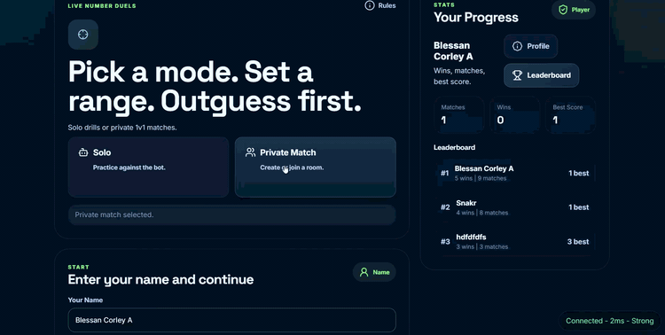
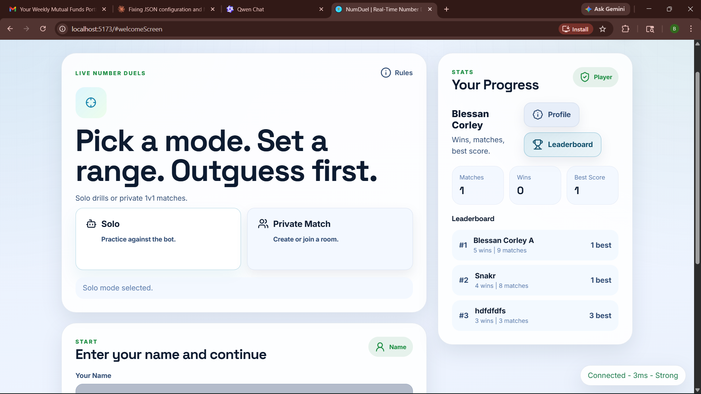
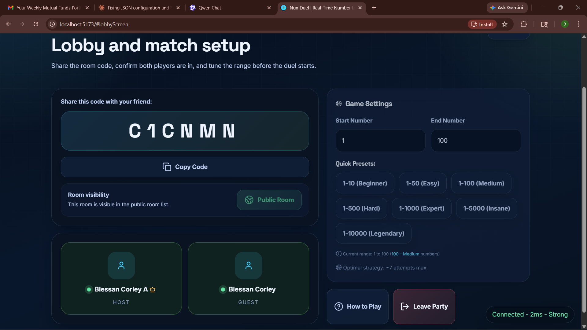
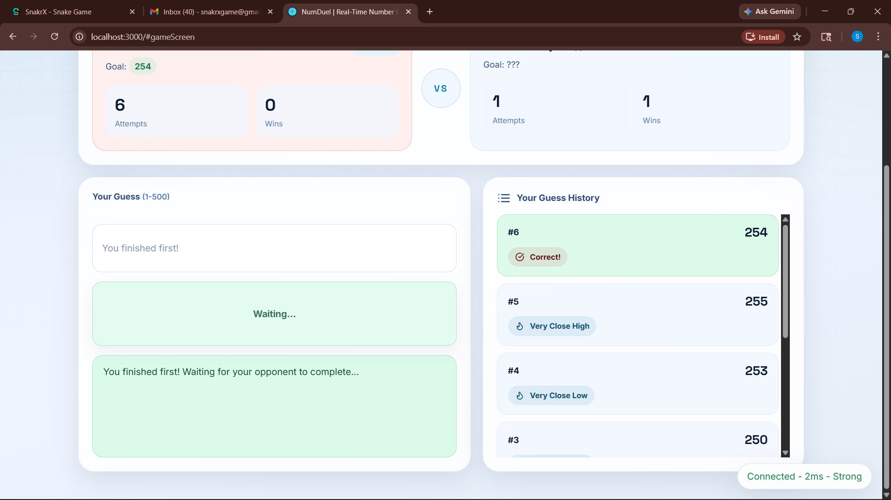
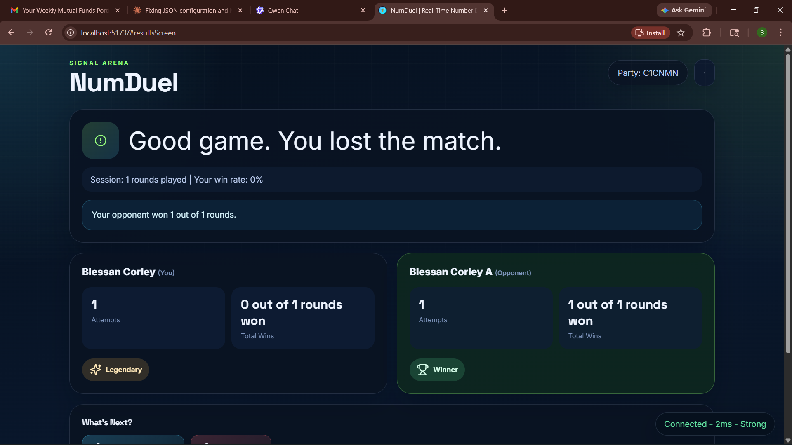
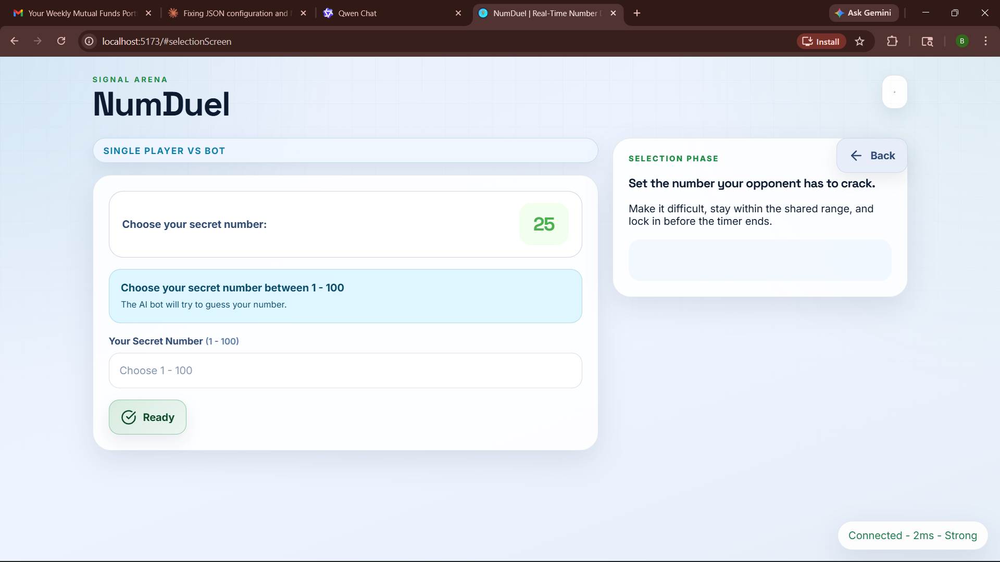
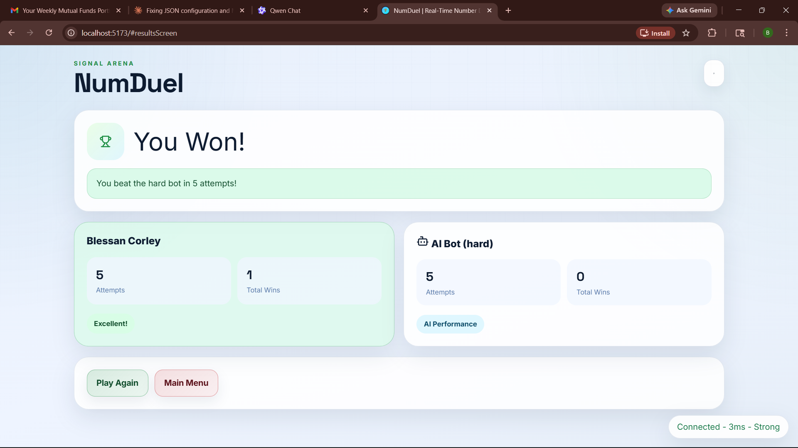

# NumDuel

Real-time 1v1 number guessing game. Two players set secret numbers within a shared range, then take turns guessing until someone wins.

**Live demo:** https://guess-the-number-multiplayer-3rk1.onrender.com/


---



## Features

- **Multiplayer 1v1** — create a party, share the 6-character code, play against a friend
- **Single-player bot** — three difficulty levels (Easy / Medium / Hard)
- **Player profiles & leaderboard** — win/loss record, best score, top 20 ranking
- **Reconnect support** — players can rejoin an active match within 120 seconds of disconnect
- **Public room directory** — browse and join open lobbies from the home screen
- **Live UI updates** — profile and leaderboard refresh automatically after each completed match

## Stack

| Layer         | Technology                                     |
| ------------- | ---------------------------------------------- |
| Runtime       | Node.js 20, Express                            |
| Real-time     | Socket.IO                                      |
| Frontend      | Vanilla JS, HTML, CSS (no framework)           |
| Session store | Redis / Upstash (in-memory fallback for tests) |
| Persistence   | PostgreSQL / Neon                              |
| Testing       | Jest, Playwright, Supertest                    |
| CI            | GitHub Actions                                 |
| Deploy        | Docker, Docker Hub, Render                     |

## Project structure

```
config/           environment config and shared constants
public/           frontend — HTML, CSS (11 modules), JS (~70 modules)
src/
  app/            service factory
  contracts/      HTTP and socket payload schemas
  errors/         custom error class and error codes
  http/           Express routes and error middleware
  lib/            database connection and migration runner
  models/         Party and Player state machines
  services/       game logic, party management, socket handlers, persistence
  storage/        Redis and in-memory store adapters
  utils/          validators, message generators
tests/
  services/       unit tests (25 suites)
  integration/    integration tests (9 suites)
  e2e/            Playwright end-to-end tests (3 suites)
docs/
  ARCHITECTURE.md architecture overview
  DEPLOYMENT.md   hosting and scaling guide
```

## Local setup

```bash
npm install
cp .env.example .env
# Fill in DATABASE_URL — Redis is optional (falls back to in-memory)
npm start
```

Open `http://localhost:3000`.

**Development (hot reload):**

```bash
npm run dev
```

**Docker (includes Redis and PostgreSQL):**

```bash
docker compose up --build
```

## Testing

```bash
npm test               # unit and integration tests
npm run test:coverage  # with coverage report
npm run test:e2e       # Playwright end-to-end tests
npm run test:ci        # full CI-style run
```

404 test cases across unit, integration, and E2E layers. Coverage thresholds enforced at 70%.

## Screenshots

| Home                                    | Lobby                                           |
| --------------------------------------- | ----------------------------------------------- |
|  |  |

| In-game                                      | Match results                             |
| -------------------------------------------- | ----------------------------------------- |
|  |  |

| Single-player setup                                   | Single-player result                    |
| ----------------------------------------------------- | --------------------------------------- |
|  |  |

## API endpoints

| Method | Path                        | Description           |
| ------ | --------------------------- | --------------------- |
| GET    | `/api/health`               | Service health        |
| GET    | `/api/readiness`            | Readiness check       |
| GET    | `/api/config`               | Client configuration  |
| GET    | `/api/stats`                | Active sessions count |
| POST   | `/api/profiles/guest`       | Create guest profile  |
| GET    | `/api/profile`              | Get profile by token  |
| GET    | `/api/leaderboard`          | Top 20 players        |
| GET    | `/api/profiles/:id/matches` | Match history         |
| POST   | `/api/validate-party`       | Validate a party code |

## Architecture

See [docs/ARCHITECTURE.md](docs/ARCHITECTURE.md) for a full breakdown.

The app runs as a single service — Express, Socket.IO, and REST APIs share one Node.js process. Redis stores active game sessions. PostgreSQL stores player profiles and match history. This keeps deployment to a single URL without needing a separate frontend service.

## Deployment

See [docs/DEPLOYMENT.md](docs/DEPLOYMENT.md) for Render, Railway, Heroku, and Docker instructions.

GitHub Actions now gates merges with lint, coverage-tested unit/integration checks, a production bundle build, Playwright E2E, and a Docker smoke test. Pushes to `main` or a `v*` tag can also publish a Docker Hub image once `DOCKERHUB_USERNAME` and `DOCKERHUB_TOKEN` are configured.

## License

MIT
